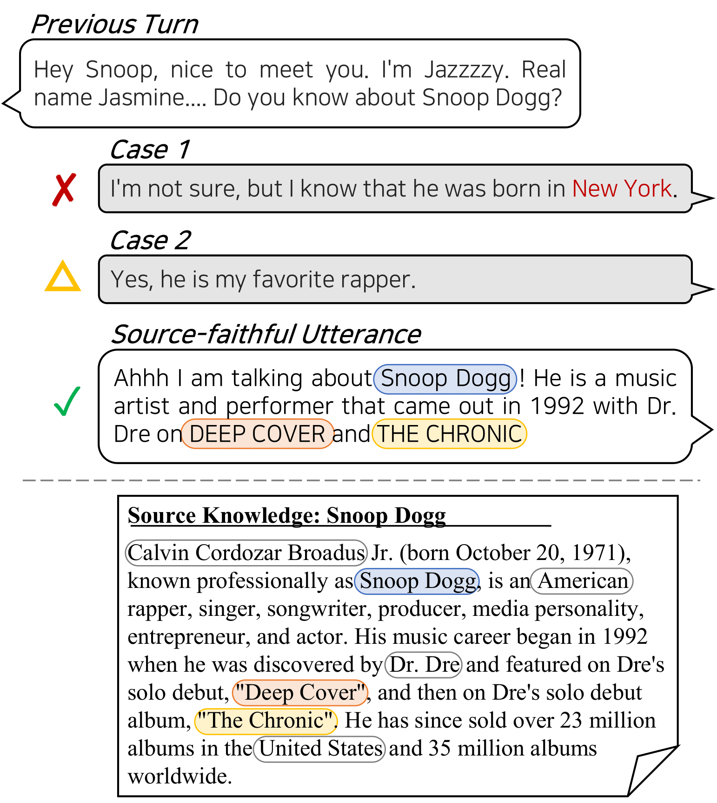

# Post-hoc Utterance Refining Method by Entity Mining for Faithful Knowledge Grounded Conversations
[Yoonna Jang*](https://github.com/YOONNAJANG), [Suhyune Son*](https://github.com/sonsuhyune), [Jeongwoo Lee*](https://github.com/jeongwoolee-jason), Junyoung Son, Yuna Hur, Jungwoo Lim, Hyeonseok Moon, Kisu Yang, and Heuiseok Lim (*Equal contributors)

Official codes for the paper: **[Post-hoc Utterance Refining Method by Entity Mining for Faithful Knowledge Grounded Conversations](https://aclanthology.org/2023.emnlp-main.295.pdf)**, accepted at [EMNLP 2023](https://aclanthology.org/volumes/2023.emnlp-main/).

</img>

### Setting Environment
We trained the models under the setting of `python==3.7` and `torch==1.5.0`,  with one RTX8000 GPU. Also, our codes are built on the codes of [huggingface](https://github.com/huggingface/transfer-learning-conv-ai), and we utilized [pytorch-ignite](https://github.com/pytorch/ignite) from pytorch in [`ignite`](https://github.com/pkchat-focus/FoCus/tree/main/ignite) folder.

1.Make a virtual environment
    
    $conda create -n ENV_NAME python=3.7

2.Install `pytorch==1.5.0`

    $conda install pytorch==1.5.0 torchvision==0.6.0 cudatoolkit=10.2 -c pytorch

3.Install the required libraries.
    
    $pip install -r requirements.txt
    

### Dataset 
This data is the modified version of the original data (which is reported in the paper) after ethical inspection.

You should create directories named **`infer_log_focus`, `train_log_focus`, `test_log_focus`, `models`, `data`** under FoCus folder.

We put train, valid, test files of the dataset in the **`data`** folder. 

The project directory should follow this directory structure:

    📦REM
    ┣ 📂data
    ┃ ┗ 📜train.json
    ┃ ┗ 📜valid.json
    ┣ 📂metrics
    ┣ 📂src
    ┣ 📜README.md
    ┗ 📜requirements.txt

### Training models
Uncomment the command lines in the **`train.sh`** file, to start training the model. 

    $ sh train.sh 

### Evaluation
Uncomment the command lines in the **`test.sh`** file, to evaluate the model on the test set. 

    $ sh test.sh

### Inference
Uncomment the command lines in the **`inference.sh`** file, to generate utterances with the trained models.

    $ sh inference.sh

### Citation
To use our data or source code, please cite our paper:

    @inproceedings{jang2023post,
      title={Post-hoc Utterance Refining Method by Entity Mining for Faithful Knowledge Grounded Conversations},
      author={Jang, Yoonna and Son, Suhyune and Lee, Jeongwoo and Son, Junyoung and Hur, Yuna and Lim, Jungwoo and Moon, Hyeonseok and Yang, Kisu and Lim, Heui-Seok},
      booktitle={Proceedings of the 2023 Conference on Empirical Methods in Natural Language Processing},
      pages={4844--4861},
      year={2023}
    }
